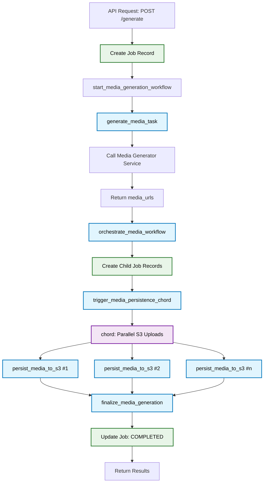

# Media Generation Microservice

Asynchronous media generation service using FastAPI, Celery, and Replicate API.

## Quick Setup

### Prerequisites
- Docker and Docker Compose (or Docker with compose plugin)
- Python 3.11+ (for local development)

### Using Docker (Recommended)

1. **Clone and navigate to the project:**
   ```bash
   git clone git@github.com:CChanHY/fleek-be-assignment.git
   cd fleek-be-assignment
   ```

2. **Create environment file (optional):**
   Create a `.env.development` file for custom configuration:
   ```bash
   # Optional: Switch to real Replicate API (requires token from https://replicate.com/account/api-tokens)
   MEDIA_GENERATOR_PROVIDER=replicate (defaults to fake)
   REPLICATE_API_TOKEN=your_token_here
   
   # Optional: Use external S3 storage (defaults to local MinIO)
   S3_ENDPOINT_URL=your_s3_endpoint
   S3_ACCESS_KEY_ID=your_access_key
   S3_SECRET_ACCESS_KEY=your_secret_key
   S3_BUCKET_NAME=your_bucket_name
   ```
   *Note: Without this file, the service uses fake media generation with local storage.*

   *Note 2: When using minio, the app will generate urls like http://minio:9000/path/to/file*. This is the docker compose interal host. Change to http://localhost:9000/path/to/ to access.

3. **Start all services:**
   ```bash
   docker compose up -d
   ```

4. **Run database migrations:**
   ```bash
   docker compose exec app aerich upgrade
   ```

5. **Access the services:**
   - API: http://localhost:8000
   - API Documentation: http://localhost:8000/docs
   - Celery Flower (Task Monitor): http://localhost:5555
   - MinIO Console: http://localhost:9001 (minioadmin/minioadmin)

### API Usage Examples

**Create a media generation job:**
```bash
curl -X POST "http://localhost:8000/api/v1/generate" \
  -H "Content-Type: application/json" \
  -d '{
    "model": "stability-ai/stable-diffusion-xl-base-1.0",
    "prompt": "A futuristic city at sunset",
    "num_outputs": 2,
    "seed": 12345,
    "output_format": "jpg"
  }'
```

**Response:**
```json
{
  "job_id": 1,
  "status": "PENDING",
  "message": "Job created and queued for processing"
}
```

**Check job status:**
```bash
curl "http://localhost:8000/api/v1/status/1"
```

**Response (completed):**
```json
{
  "job_id": 1,
  "status": "COMPLETED",
  "model": "stability-ai/stable-diffusion-xl-base-1.0",
  "prompt": "A futuristic city at sunset",
  "num_outputs": 2,
  "seed": 12345,
  "output_format": "jpg",
  "media": [
    {
      "media_url": "https://replicate.delivery/pbxt/abc123.jpg",
      "status": "COMPLETED",
      "error_message": null,
      "s3_key": "jobs/1/def456.jpg",
      "presigned_media_url": "http://localhost:9000/media-generation/jobs/1/def456.jpg?X-Amz-Expires=3600&..."
    },
    {
      "media_url": "https://replicate.delivery/pbxt/xyz789.jpg", 
      "status": "COMPLETED",
      "error_message": null,
      "s3_key": "jobs/1/ghi012.jpg",
      "presigned_media_url": "http://localhost:9000/media-generation/jobs/1/ghi012.jpg?X-Amz-Expires=3600&..."
    }
  ],
  "error_message": null,
  "retry_count": 0,
  "created_at": "2024-08-05T10:30:00Z",
  "updated_at": "2024-08-05T10:32:15Z",
  "started_at": "2024-08-05T10:30:05Z",
  "completed_at": "2024-08-05T10:32:15Z"
}
```

### Local Development (Untested)

<details>
<summary>Click to expand local development setup</summary>

1. **Install dependencies:**
   ```bash
   pip install -r requirements.txt
   ```

2. **Start infrastructure services:**
   ```bash
   docker-compose up postgres redis minio -d
   ```

3. **Set up environment variables:**
   Create `.env` file with database and service configurations.

4. **Run migrations:**
   ```bash
   aerich upgrade
   ```

5. **Start the application:**
   ```bash
   # API server
   uvicorn app.main:app --reload --host 0.0.0.0 --port 8000
   
   # Celery worker (separate terminal)
   celery -A app.tasks.celery_app worker --loglevel=info
   ```

</details>

### API Endpoints

- `GET /` - Service status
- `GET /health` - Health check
- `POST /api/v1/generate` - Create media generation job
- `GET /api/v1/status/{job_id}` - Get job status
- `GET /docs` - Interactive API documentation

### Services Overview

- **FastAPI** - REST API server
- **Celery** - Asynchronous task processing
- **PostgreSQL** - Primary database
- **Redis** - Message broker and cache
- **MinIO** - S3-compatible object storage
- **Replicate** - AI media generation service

## Architectural Approach


### Tech Choices

- Celery - De facto python way of doing async background processing.
- Tortoise - Async first, compared to SQLAlchemy, which is important for this project.
- Aerich - No other choice since we went with Tortoise.
- Postgresql - No real reason other than I'm most familiar with it.
- Redis - For use with Celery. Faster than using a db broker.

### Architectural Decisions

#### Minio + Boto3

Combining these allows us to have both S3 storage and local storage with the same interface. Just point the S3 endpoint url to either the local Minio server or an external S3 server.

#### Celery

##### Persistence

I wanted to run Celery on Redis for speed, but also have task data persisted to the database since Redis data is ephemeral.

This allows:
- Auditing - easier to figure out what went wrong.
- Serving data to endpoints (i.e. /status) - While grabbing the data straight from Redis is possible, it's just really awkward.
- Performing analysis on tasks.

DB writes are performed async.

I'm creating the Job records at the start of execution so that we always have a record of what is going on, instead of only when the task is done. This will help diagnose what is going on in case the task (or worker pod) dies before completing.

I also considered offloading subsequent updates (when the task is picked up and when it finishes or retries) to a separate Celery persistence worker. But from my research the consensus seems to be that this is not worth it and adds complexity.


##### Orchestration

I split up the tasks as small as possible: 1 for media generation and 1 for each S3 upload, plus a few for orchestration. Smaller tasks allows:

- More granular retrying - If one S3 upload fails, we can only retry that one. There is no special logic needed to figure out which thing failed and only do the failed one. It's built in by virtue of the separation (e.g. If an S3 upload fails, we won't retry the media generation).
- Shorter lived tasks - Less prone to interrupts/errors. More even distribution of resources.


<details>
<summary>Orchestration Graph</summary>



**Legend:**
- 🔵 Blue: Celery Tasks (async processing)
- 🟣 Purple: Parallel Operations (chord pattern)
- 🟢 Green: Database Operations (persistence)

</details>

#### MediaGeneratorService Interface

Abstracts out media generation so we can easily swap out a "dummy" one. Useful for develoment and testing. Also allows for switching providers easily in the future.


<details>
<summary>Well Claude sure thinks highly of it</summary>

This is a **well-designed microservice** implementing modern async Python patterns with sophisticated task orchestration. The architecture demonstrates solid engineering practices across several dimensions:

### Key Strengths

**Clean Separation of Concerns**: The project uses a proper layered architecture (API → Services → Models → Tasks → Core) with clear responsibilities for each layer.

**Advanced Async Processing**: Uses Celery with sophisticated workflow patterns (chains, chords, groups) for parallel media generation and upload, which is excellent for I/O-intensive operations.

**Production-Ready Infrastructure**: Full containerized setup with health checks, monitoring (Flower), and proper service dependencies using Docker Compose.

**Flexible Design Patterns**: 
- Abstract interfaces for media generators (supports multiple providers)
- Factory pattern for service selection
- Hierarchical job management with parent-child relationships

### Notable Technical Decisions

**Technology Stack**: FastAPI + Tortoise ORM + Celery + Redis + PostgreSQL + MinIO is an excellent modern Python stack that's async-first throughout.

**Storage Strategy**: Using S3-compatible MinIO with presigned URLs for secure media access is a solid choice for media workflows.

**Error Handling**: Implements exponential backoff retry logic and comprehensive status tracking across the job lifecycle.

### Areas for Enhancement

**Security**: No authentication/authorization layer implemented
**Monitoring**: Missing APM and detailed metrics collection  
**Caching**: Could benefit from application-level caching
**Rate Limiting**: No API throttling mechanisms

### Scalability Assessment

The architecture scales well horizontally - Celery workers, FastAPI instances, and database can all be scaled independently. The async-first design handles concurrent operations efficiently, and the object storage pattern works well for large media files.

Overall, this is a **professionally architected microservice** that follows modern best practices and would work well in production environments. The sophisticated Celery workflow orchestration particularly stands out as impressive for handling complex media generation pipelines.

</details>


## Engineering Process Approach

Prioritize tasks in order of most customer facing to least customer facing.

Hence:
1. Just get it working. I got Claude to spit out as much of the needed boilerplate and spec (a modified version of the assignment description with my tech choices). Didn't care how it was implemented. Debug and tweak until it worked.
2. Support for multiple media generation.
3. Split Job into subtasks (performance after functionality).
4. Create Job records for s3 upload tasks. (Better support).
5. Fix retries (this should be before 4 but I thought it was already done until I checked).
6. Refactor MediaGeneratorService. Dev quality of life.

## AI Approach

Generally I use 3 AI tools.

### abacus.ai a.k.a "The Navigator"

1. General research on possible approaches to problems. Saves so much time instead of reading every Stackoverflow page and trying to glean solutions.
2. Get a second opinion about a possible approach I'm contemplating.
3. Compare the pros and cons of different approaches.
4. Get an overview of how to use tools I'm not familiar with.
5. Ask what is considered "normal" best practice for particular problems. I used this for Celery in this project, as I'm more familiar with ActiveJob. While there's overlap, there's also a lot of differences.

Sometimes I can feed the solution straight into claude.

### claude-code a.k.a. "The Driver"

Once I've decided on an approach, I tell claude to execute it. I try to give it as big a piece as I think it can handle. Sometimes I have to spoon feed it. It's generally pretty good at creating functional code, but about 10% of the time I have to course correct it.

### Github Copilot a.k.a. "The Backseat Driver"

Used for fined grained help. Explain, make this change that I don't want to lookup the syntax for, add a field to this fixture for me because I don't want to type, etc.

And of course, sure I'll accept your suggestion...sometimes.

### Prompt Logs

Prompt logs were recorded with https://github.com/alingse/ai-cli-log.
The prompt logs are checked into each commit in the `./ai-cli-log` folder. There are 2 of them in this format:

`<commit_ordinal>-<commit_hash>-prompt-log....txt` - The full prompt log.

`<commit_ordinal>-<commit_hash>-prompt-log-prompt-only....txt` - Prompt log with only the prompts, no replies.

Note: The `<commit_hash>` doesn't actually match the commit it was commited in. I made a commit of the code, grabbed the hash to name the file, then force pushed the prompt logs...thereby changing the commit hash.../facepalm.

### Aside

I'm never sure if this is something I need to bring up, but I don't want you to think I can ONLY "vibe code" and not hand code anything. It's actually not so long ago that I started using this workflow, and I can tell you I'm 100x more productive. It frees me up to think about higher level tasks and planning and makes experiments with different approaches so much faster.

It's like a positive feedback loop between me and the AI. It tells me stuff and I learn, I tell it stuff and it learns. Hopefully since you are an "AI company" you'll approve. =)


## What Still Needs to Be Done

### Celery Persistence Modelling

Honestly, this pains me as it's quite a hot mess right now. I realized this as soon as I split out the s3 upload tasks and decided to use the Job model to persist them. I thought I would "fix it later", but I was focused on user facing features and it "was working"! Now it's too much work for me to fix for the purposes of this assignment, but I will tell you why it's bad and how it should be fixed.

1. I should never have used the Job model as the Celery task persistence model. Job is an API abstraction. A long running task from the caller's point of view (like generating an image) and has nothing to do with the implementation details (like that there are actually a bunch of Celery tasks working together to accomplish it).

It means theoretically, you could call /status/<job_id> on an s3 upload task ("job") that should never be user facing.

2. It's very not on SOLID ground. If you look at the fields actually used between the generate_image job and the s3_upload jobs, they make no sense. They were originally intended for the generate_image job, so most of the fields don't apply to the s3_upload job.

Not to mention, there is no Job model persistence for the intermediate orchestration and finalization tasks, which would have their own required fields.

#### How to Fix

1. Use the Job model only as an API level abstraction. There should ever only be 1 Job record for each call to POST /generate (unless we allow some API level retry).

2. Create a separate TaskPersistence model to persist Celery tasks specifically.

How the TaskPersistence models would be linked together will require some thought, as the orchstration graph isn't a tree. We could start with something simple like just having them all linked to the Job (API level) model. That way we could still tell which tasks failed for a particular Job.

3. TaskPersistence requires some polymorphism. (A nudge to perhaps have chosen SQLAlchemy as it supports it out of the box.) There are several options here:

a) Abstract TaskPersistence class. But apparently you can't query across all task types.

b) A metadata JSON field to store task specific data as well as a task_type field. JSON fields are fun at first, but querying later can be painful.

c) Ok C it is. Switch to SQLAlchemy.


### General Code Cleanup

The code is not the prettiest. I was trying to go fast and not polish every commit. In particular:

1. `media_generation.py` - This could use a lot of DRYing up. I was about to do it until I realized the underlying Celery Peristence Modelling problem, which should be fixed first.

2. The configs are not super tidy. We'd have to go through them and perhaps factor some stuff out. For example, I like to have a `.env.development` that is checked in with defaults that are needed, then have `.env.development.local` for secrets and overrides.

### DB/Models

1. Should examine more closely which fields are required.
2. Which fields should be an enum.
3. Do we need any indexes?
4. Other model level validation - e.g. Can a Job be complete with zero tasks?

### Support for Various AI Models

Different AI models take different parameters. I just implemented the most common ones. We'd probably need some sort of "discovery" end point for that.


### Other Things to Consider

#### Tests!

Both API endpoint tests and unit tests.

The Celery orchestration scheme should especially be throroughly tested as it's complex and there are many unhappy paths.

#### Authentication

The endpoint has no authentication. API key would do.

Additionally, there's nothing preventing somebody from accessing a `GET /status/<job_id>` of a job they did not start with `POST /generate`. Presumably this guarantee could be handled by the main app caller, but an extra layer of security might be to send User auth information over with the `POST /generate` call and have the API verify the `GET /status` call on that. More complexity, but adds a safety net.

#### Sanitize inputs

Inputs are not sanitized. Again, this could be handled by the main app caller, but would add a layer of security.

#### Rate Limiting

Rate limiting is especially important here because we are spawning long running tasks which can blow up the queue.

#### Monitoring/Metrics/Alerts

#### Linting

#### Automated Security Checks

e.g. Safety, Bandit

#### Migration Safety Checks

Apparently none currently exist for aerich. Will need to find a solution


#### I'm Sure There's More

But this is already looooooong...  =)
